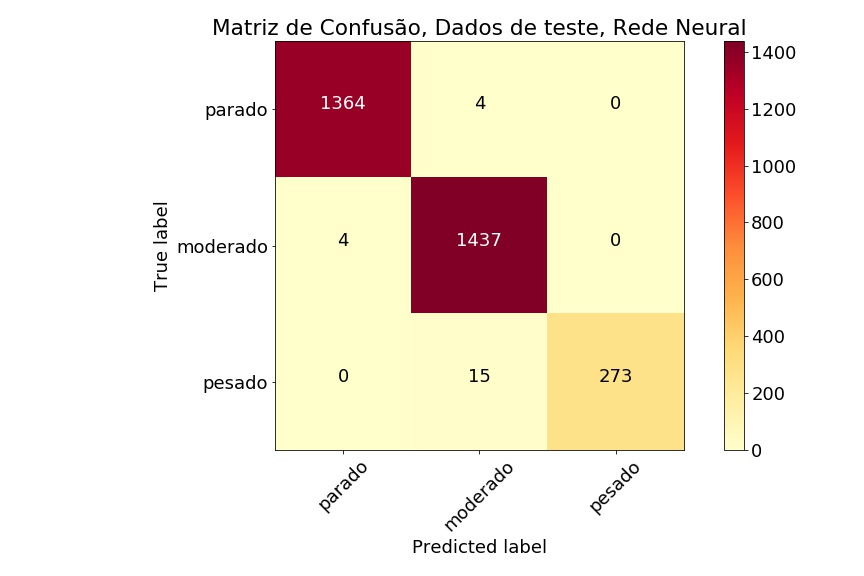
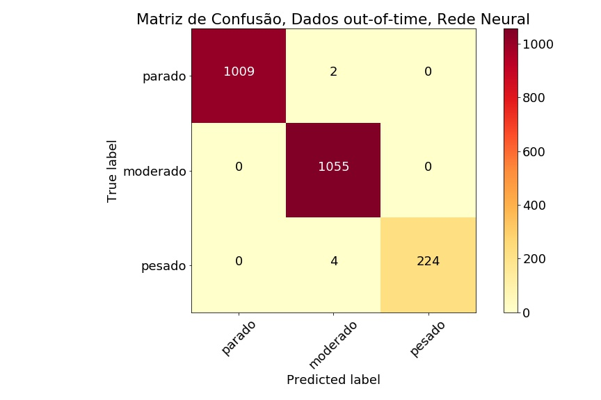

# Assis - Orientação à Dados

## Visão geral 

A plataforma Assis irá oferecer algumas funcionalidades orientadas à dados que irão facilitar tanto a vida do usuário, como gerar valor às partes interessadas. Automação, insights de mercado e recomendações são os pilares da plataforma, que busca entender da forma mais granular possível a realidade e situação de cada parceiro caminhoneiro usuário Assis. Para isso, o uso de **sensores de movimento (IMU)** e **geolocalização** são essenciais para extrair conhecimento e gerar valor para nossos usuários.

1. **Mensuração de tempo de rodagem:** Pensando em orientar o caminhoneiro usuário a realizar uma pausa para se exercitar a cada intervalo de tempo, a plataforma Assis irá inferir quando o caminhoneiro inicia uma jornada por meio de informações de velocidade obtidas por meio de IMUs e deltas nas coordenadas obtidas pelo GPS do dispositivo móvel. Tudo isso sem inputs dos usuários para indicar o começo da roda.
   
2. **Detecção e avaliação de intensidade da atividade física:** A ideia central do aplicativo é remunerar em forma de benefícios o caminhoneiro que realize atividades físicas como forma de cuidar de sua saúde. Pensando em uma maneira de identificar e validar a realização da atividade física, foi criado um modelo baseado em aprendizado de máquina que, por meio de dados de acelerômetro, identifique de forma automática quando o usuário realiza uma atividade física e qual sua intensidade. O modelo é capaz de identificar se o usuário está em uma condição sedentária, se está realizando uma atividade moderada e se é um exercício de intensidade superior. Além de entender esses níveis de atividade física, esse modelo proporciona a validação da realização de atividade física, assim os pontos de benefícios serão creditados quando o caminhoneiro realmente tiver se exercitado. 
   
3. **Sistema de recomendação de atividades:** O único input do usuário ao final da atividade física é um feedback simples de como ele se sente, se o exercício foi fácil ou se ele não se sentiu confortável. Baseado nesses inputs simples, aplicamos um sistema de recomendação que irá recomendar uma sequência de exercícios baseados em inputs positivos de outros usuários com perfis semelhantes, como idade e IMC. Recomendando atividades mais agradáveis aos caminhoneiros, minimizamos a possibilidade de o caminhoneiro ignorar as atividades, se tornar inativo na plataforma ou até mesmo a desinstalação do aplicativo. Além disso, conseguimos trazer alguns insights interessantes sobre o perfil do caminhoneiro, como aqueles que preferem atividade mais intensas e aqueles que podem apresentar problemas de saúde devido a dificuldade de realização de atividades.

4. **Recomendação de consulta médica e/ou exames:** Outros insumos valiosos proporcionado nos feedbacks das atividades físicas é identificar caminhoneiros com sequências de atividades com avaliações negativas. Esses feedbacks podem indicar algum problema de saúde não tratado do caminhoneiro que pode necessitar um diagnóstico médico mais preciso da situação de saúde do usuário e trazer a possibilidade de tratar alguma patogenia precocemente.

## Modelo implementado - *Detecção de Atividade*

Durante o desenvolvimento da plataforma, foi implementado um modelo de **Detecção e Identificação de Atividades**, com o objetivo de validar a atividade feita pelo caminhoneiro. Para tal, é necessário que o motorista esteja somente de posse de seu smartphone no bolso ou nas mãos para que o movimento seja capturado pelos acelerômetros do aparelho e todo o resto fica por conta de um modelo de Deep Learning treinado para definir qual a intensidade da atividade.

Para o treinamento do modelo, utilizamos um dataset público disponível no Kaggle - [MotionSense Dataset : Smartphone Sensor Data - HAR](https://www.kaggle.com/malekzadeh/motionsense-dataset?select=A_DeviceMotion_data) que foi coletado usando justamente um smartphone. Nele estão marcados o tipo de ativadade de cada movimento. Como nosso objetivo é somente identificar somente se a atividade e está acontecendo e sua intensidade, dividimos os tipos de atividade em três classes:

1. **Sedentário:** Ausência de movimento
2. **Moderado:** Movimentos leves
3. **Pesado:** Movimentos mais vigorosos

Ainda, com objetivo de tornar o processamento do modelo mais leve, utilizamos somente três variáveis: a aceleração nos eixos $x$, $y$ e $z$ com uma janela de 100 leituras de cada uma dessas três variáveis. Como são dados temporais, adotamos um modelo de Rede Neural Convolucional com camadas recorrentes, para que sejam capturados as variações temporais. Abaixo estão os resultados, mostrados em forma de matriz de confusão, para os dados de teste e em seguidas os dados de holdout:

**O processo de desenvolvimento do modelo pode ser encontrado neste [Jupyter Notebook](/hackathon_ccr_data_analytics/notebooks/motion_detencion.ipynb)**

## Execução em produção

Para a execução da tarefa de detecção de atividade devemos considerar que o local de atividade do caminhoneiro pode não ter internet móvel disponível, então o ideal que a validação do exercício tivesse que ser feito de forma offline. Para tanto consideramos a ferramenta Tensorflos.JS onde é possível executar a predição do modelo dentro de dispositivos móveis sem maiores problemas. Além de executar offline, esse tipo de execução proporciona economia de dados para o usuário e maior confiabilidade nos resultados obtidos.
